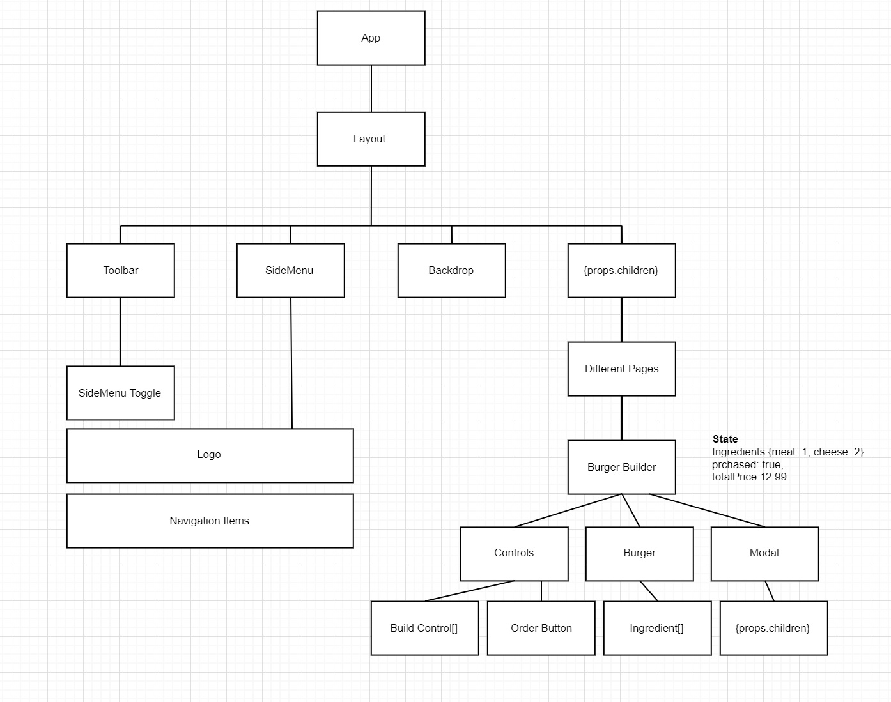

# Designing a React App



## Steps
1. Component Tree/Component Structure
2. Application State(Data)
3. Components vs Containers

## Choose a font
1. Go to https://fonts.google.com and select a font
2. Select customize > Select bold 700
3. Go to Embed
4. Copy link and paste above title in public\index.html
5. Copy css and insert within index.css
```
body {
  margin: 0;
  padding: 0;
  font-family: 'Open Sans', sans-serif;
  -webkit-font-smoothing: antialiased;
  -moz-osx-font-smoothing: grayscale;
}
```

## Spinners
* [Spinners](https://projects.lukehaas.me/css-loaders/)
1. Choose background and foreground color.
2. copy css into a Spinner.module.css
3. Copy html into component and import css
```
import React from 'react';

import classes from './Spinner.module.css';

const spinner = () => {
    return ( 
        <div className={classes.Loader}>Loading...</div>
     );
}
 
export default spinner;
```

## Design Frameworks
* [React Rocks](https://react.rocks/)
* [Gatsby][https://www.gatsbyjs.org/]
* [Materail UI](https://material-ui.com/)
* [React Bootstrap](https://react-bootstrap.github.io/)

## Alternative
* [PREACT - Lightweight alternative to React](https://preactjs.com/)

## Authors

* **David Ikin**