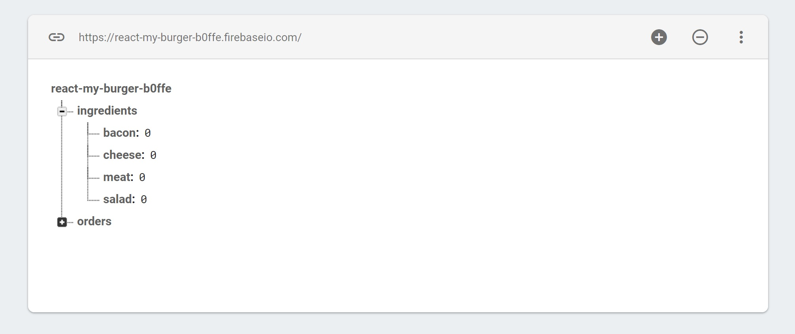

# Getting Started with React

## Designing an App
* [See Designing a React App](Design.md)

## Setting up Environment
1. [Download and install Visual Studio Code](https://code.visualstudio.com/)
2. [Download and install Node.js](https://nodejs.org/en/download/)
3. Open command prompt and run
```
npm install npm@latest -g
```
4. Open Visual Studio Code
5. Click File > Auto Save
6. Click View > Terminal
7. Open extensions (Ctrl+Shift+X) 
8. Install the [Debugger for Chrome](https://marketplace.visualstudio.com/items?itemName=msjsdiag.debugger-for-chrome) extension
9. Install the [Simple React Snippets](https://marketplace.visualstudio.com/items?itemName=burkeholland.simple-react-snippets) (See below for commands)
10. Install [Chrome React Developer Tools](https://chrome.google.com/webstore/detail/react-developer-tools/fmkadmapgofadopljbjfkapdkoienihi?hl=en)
11. Install [Redux Dev Tools](https://chrome.google.com/webstore/detail/redux-devtools/lmhkpmbekcpmknklioeibfkpmmfibljd?hl=en) 

## Creating a new App with create-react-react, npm, HMR and git repo
1. To create a new app open a command line and use the [create-react-app](https://reactjs.org/docs/create-a-new-react-app.html#create-react-app) command where my-app is the name of the new app.
```
npx create-react-app my-app --use-npm
```
2. Install extra packages
```
npm install bootstrap@4
npm install prop-types
npm install react-router-dom
npm install axios
npm install lodash
```
3. Add the following import to src/index.js
```
import '../node_modules/bootstrap/dist/css/bootstrap.min.css';
```
4. Create the following folders.
```
containers(Contain App.js and App.css. These are stateful classes. Access this.state and this.props. render() method. Has component Lifecycle events.)
containers\views (Container pages such as home.js, about.js)
components (Each should have .js and .css file and be stateless. Access only props. No render() method)
hoc (High Order Components. See Error Boundary and Aux)
assets\css
assets\fonts
assets\images
assets\svg
```
5. Copy the following files into containers. Update the index.js to import the App from containers.
```
App.js
App.test.js
App.css
```
6. Copy the following files into assets\svg. Update the App.js to import the logo from /assets/svg/.
```
logo.svg
```
7. To generate the build scripts and config run the following commands. Alternatively will depend on react-scripts.
```
cd my-app
npm run eject
```
8. To enable Hot Module Replace (Editing without refreshing app) edit the index.js
```
import React from 'react';
import ReactDOM from 'react-dom';
import './index.css';
import App from './App';
import * as serviceWorker from './serviceWorker';

const render = () => {
    return ReactDOM.render(
       <App />,
      document.getElementById('root')
    );
  };

  render();

//HMR
//https://medium.com/@brianhan/hot-reloading-cra-without-eject-b54af352c642
//https://duske.me/setting-up-hot-module-replacement-with-create-react-app-and-redux/
if (module.hot && process.env.NODE_ENV !== 'production') {
    console.log('HMR Enabled for Components');
    module.hot.accept('./App', () => {
        console.log('HMR App');
        render();
      });
}

// If you want your app to work offline and load faster, you can change
// unregister() to register() below. Note this comes with some pitfalls.
// Learn more about service workers: http://bit.ly/CRA-PWA
serviceWorker.unregister();
```
9. See enabling css modules.

## Progressive Web App
* By default the create-react-app creates a fully functional Progressive Web App which works offline by using the service worker. Great for occasionally connected devices without internet but may require extra coding.
* All requests will go to the service worker and at regular interval the service worker will see if there are any updates
* This can be switched on/off by changed the last list in index.js
```
serviceWorker.register();
serviceWorker.unregister();
```

## Setting up App for Development
1. Open a command prompt and direct to the my-app directory.
2. Launch Visual Studio Code by running the following command
```
cd my-app
code .
```
3. Open extensions (Ctrl+Shift+X) 
4. Install the [Debugger for Chrome](https://marketplace.visualstudio.com/items?itemName=msjsdiag.debugger-for-chrome) extension
5. Press Reload
6. To configure the [Debugger for Chrome](https://marketplace.visualstudio.com/items?itemName=msjsdiag.debugger-for-chrome) press (Ctrl+Shift+D)
7. Click the cog
8. Choose Chrome from the environment dropdown
9. Set launch.json to the following.  --disable-web-security will bypass CORS.
```
{
    "version": "0.2.0",
    "configurations": [
        
        {
            "type": "chrome",
            "request": "launch",
            "name": "Launch Chrome against localhost",
            "url": "http://localhost:3000",
            "webRoot": "${workspaceRoot}/src",
            "runtimeArgs": ["--disable-web-security"]
        }
    ]
}
```

## Launching App for Development from Command Prompt
1. Open a command prompt and direct to the my-app directory.
2. To launch the app on http://localhost:3000/ run the npm start command.
```
cd my-app
npm install
npm start
```

## Launching App for Development with Visual Studio Code
1. Open a command prompt and direct to the my-app directory.
2. Launch Visual Studio Code

```
code .
```
3.  Click View > Terminal
4. Run the following command
```
npm start
```

## Building App for Production
1. Open a command prompt and direct to the my-app directory.
2. run the npm run build command.
```
npm run build
```
3. app will be output to my-app\build

## Running Production Build
1. Open a command prompt and direct to the my-app directory.
2. Install static server
```
yarn global add serve
```
3. Launch the static server
```
serve -s build 
```

## Routing
* [Getting Started with React Router](Router.md)


## Forms
* [Getting Started with React Forms](Forms.md)

## Useful things to know
* function name(arg){ } is equivalent to const name = (arg) =>{ } or  const name = arg =>{ }
* you can use async/await rather promises .then()
* Use let/const and not var
* destructuring pulls out the specified value
```
{name} = {name:'Max', age:28}

const numbers = [1, 2, ,3];
[num1, num3] = numbers;
```
* ... = splits up array elements OR object properties
* copy object or array by using const copy = {...original};
* map array function = foreach & return
```
const numbers = [1, 2, 3];
const newArray = numbers.map((item) => {return item * 2;});
```
* function sortArgs(...args) {return args.sort() } allows for an unlimited amount of arguements to be merged into an array. Similar to .NET params
* export default Person > import name from './person' or import prs from './person'
* export const Person > import { Person } from './person' or import { Person as p } from './person' or import * as bundled from './person'
```
class Human{
  gender = 'male';
}

printGender = () =>{
  console.log(this.gender);
}

class Person extends Human {
  name = 'Max';
  gender = 'female';

  printMyName = () => {
    console.log(this.name);
  }
}

const person = new Person();
person.printMyName();
person.printGender();
```
* use {props.children} to render innerHtml

## React Development Workflow
 JSX > Babel (react-scripts) > React JavaScript (react) > React Dom (react-dom) > Html

## React Component
1. Props
2. State
3. Render

## React vs Angular vs Vue
| React        | Angular           | Vue  |
| ------------- |:-------------:| --------:|
| Library     | Framework | Library |
| Facebook      | Google      |   Community |
| MIT | MIT      |    MIT |
| 1-way data binding | 2-way data binding      |    1-way data binding |
| UI in JavaScript | UI in HTML      |    UI in HTML |

## Import/Export Module Components
```
export component;
import {component} from "./module";

export default component;
import comp from "./module";

export default component, x;
import comp, {x} from "./module";
```

## What is State?
Private Data for the Component
Calling setState triggers re-render of component
Calling setState only updates that particular state item
if the data doesn't need to change (not used in the Render method) then store it in a private property such as this.property
Initialize state with state = {};

## Example Function Component (View Component)
```
<Header>This is the children content</Header>
```
```
import React from 'react';
import logo from '../../assets/svg/logo.svg';

const header = (props) => (
 <header className="row">
    <div className="col-md-5">
        
    </div>
    <div className="col-md-7 mt-5 subtitle">
        Providing houses world wide
    </div>
    {props.children}
 </header>
);

export default header; 
```

## Simple React Snippet for Function Component
* lowercase convention
imr + tab = import React
```
import React from 'react';
```
sfc = stateless function component
```
const featuredHouse = (props) => {
    return (  );
}
 
export default featuredHouse;
```

## Example Class Component (State Component)
* Uppercase convention
* A Component will update whenever state is set.
* A PureComponent will only update if state has changed. It will prevent child components updating if evaluated to false.
```
import React, { Component } from 'react';
import '../../assets/css/App.css';
import Header from '../../components/header/header';

class App extends Component {
  state = {};

  componentDidMount(){
    //Good place to fetch data
    this.fetchHouses();
  }

  fetchHouses =() =>{
    fetch('/houses.json')
    .then(rsp => rsp.json()) 
    .then(allHouses => {
      this.allHouses = allHouses;
      this.determineFeaturedHouse();
    })
  }

  
  determineFeaturedHouse = () => {
    if (this.allHouses) {
      const randomIndex = Math.floor(Math.random() * this.allHouses.length);
      const featuredHouse =  this.allHouses[randomIndex];
      this.setState({ featuredHouse });
    };
  }

  render() {
    return (
     <div className="container">
     <Header subtitle="Providing houses all over the world"/>
     </div>
    );
  }
}

export default App;
```

## Example Class Component 2 - Updating State
```
class Score extends React.Component {
	constructor(props){
		super(props);
		this.state = {score:0};
		
		//make 'this' available in click handlers
		//use arrow functions instead of bind
		
		this.incrementScore = this.incrementScore.bind(this);
		this.decrementScore = this.decrementScore.bind(this);
    
		this.handleChange = this.handleChange.bind(this);
	}
	
  componentDidMount(){

  }
  
	incrementScore(){
		this.setState(
		{ score: this.state.score + 1 }
		);
	}	
	
	incrementScore2 = (val) => {
		this.setState(
		{ score: this.state.score + 1 }
		);
	}	
	
	decrementScore(){
		this.setState(
		{ score: this.state.score - 1 }
		);
	}	
  
   handleChange(event) {
    this.setState({value: event.target.value});
  }
  
	render()
	{
  	//Destructuring
    var {teamName} = this.props;
		return (
		<div>
		<h2>Score board for the {teamName}</h2>
		<div>
		Score: {this.state.score}<br/>
    <input value={this.state.value} onChange={this.handleChange} />
		<button onClick={this.incrementScore}>+</button>
		<button onClick={() => this.incrementScore2(2)}>+2</button>
		<button onClick={this.decrementScore}>-</button>
    {this.state.value}
		</div>
		</div>
		);
	}
}

ReactDOM.render(<Score teamName="Tigers" />, mountNode);
```

## Prop Types for Type Safety
1. It is a good idea to always use prop-types for type safety.
2. Install using the following command
```
npm install prop-types
```
3. Example class component with prop-types
```
import React, { Component } from 'react';
import PropTypes from 'prop-types'

class UpdateScore extends Component {
    state = {  }
    render() { 
        return (<div></div>);
    }
}

UpdateScore.propTypes = {
    conversionRate: PropTypes.number.isRequired,
    click: PropTypes.func,
    name: PropTypes.string,
    age: PropTypes.number
}

export default UpdateScore;
```

## Simple React Snippet for Class Component
imrc + tab = import React Component
```
import React, { Component } from 'react';
```
cc = class component
```
class House extends Component {
    state = {  }
    render() { 
        return (  );
    }
}
 
export default House;
```

## Lifecycle Methods Creating
1. constructor(props)
2. componentWillMount()
3. render()
4. renderChildComponents
5. componentDidMount() //Called immediately after first render once.

## Lifecycle Methods Updating
1. componentWillReceiveProps(nextProps) - Only if updated externally
2. shouldComponentUpdate(nextProps, nextState)
3. componentWillUpdate(nextProps, nextState)
4. render()
5. updateChildComponentProps
6. componentDidUpdate()

## Lifecycle Methods Unmount
```
componentWillUnmount()
```

## Lifecycle Methods Error
```
componentDidCatch()
```

## Props Type Safety
```
npm install --save prop-types
import PropTypes from 'prop-types';
House.propTypes = {house: PropTypes.object.isRequired}
```

## Css as Javascript object
```
const style={
  backgroundColor: '#202020';
  padding: '12px',
  borderRadis: '2px'
};

<div style={style}>
```

## Scoped Css modules
1. No longer need to eject
```
2. Import classes instead of the whole css file by naming css file *.module.css
```
import classes from './App.module.css';
```
3. Assign property of classes
```
<div className={classes.App}>
```

## High Order Components = Wrapper
### Error Boundary - wrapper around code that is expected to fail
1. Create ErrorBoundary.js class
```
import React, { Component } from 'react';

class ErrorBoundary extends Component{
  state ={
    hasError: false,
    errorMessageL ''
  }

  componentDidCatch = (error, info) =>{
    this.setState({hasError: true, errorMessage: error});
  }

  render(){
    if(this.state.hasError)
    {
      return <h1>{this.state.errorMessage}</h1>;
    }
    else
    {
      return this.props.children;
    }
  }
}

export default ErrorBoundary;
```
2. Use in a component
```
import ErrorBoundary from './ErrorBoundary/ErrorBoundary';

return <ErrorBoundary key={person.id}><Person/></ErrorBoundary>
```
### Aux = Html Wrapper
```
const aux = (props) => props.children;
export default aux;
```
2. Use in a component
```
import Aux from '../hoc/Aux';
return (
<Aux>
  <h1>Heading 1</h1>
  <h1>Heading 2</h1>
</Aux>);
```

### WithClass = Div Class Wrapper
* upperCase contention
```
import React from 'react';
const withClass = (props) =>(
  <div className={props.classes}>
    {props.children}
    </div> 
);
export default withClass;
```
2. Use in a component
```
import WithClass from '../hoc/WithClass';
return (
<WithClass classes={classes.App}>
  <h1>Heading 1</h1>
  <h1>Heading 2</h1>
</Aux>);
```

### WithClass v2 = Div Class Wrapper
* lowercase contention
```
import React from 'react';
const withClass = (WrappedComponent, className) =>(
  return (props) =>(
    <div className={className}>
      <WrappedComponent {...props} />
    </div>
  )
);
export default withClass;
```
2. Use in a component
```
import withClass from '../hoc/withClass';
import Aux from '../hoc/Aux';

return (
<Aux>
  <h1>Heading 1</h1>
  <h1>Heading 2</h1>
</Aux>);

export default withClass(App, classes.App);
```

### WithClass v3 Stateful = Div Class Wrapper
* lowercase contention
```
import React, {Component} from 'react';
const withClass = (WrappedComponent, className) => {
  return class extends Component{
    render(){
       return ()(
        <div className={className}>
          <WrappedComponent {...this.props} />
        </div>
       )
    }
  }

}

export default withClass;
```
2. Use in a component
```
import withClass from '../hoc/withClass';
import Aux from '../hoc/Aux';

return (
<Aux>
  <h1>Heading 1</h1>
  <h1>Heading 2</h1>
</Aux>);

export default withClass(App, classes.App);
```

## Testing with [Jest](https://jestjs.io/docs/en/tutorial-react.html)
1. Run the following command
```
npm test
```
## Firebase - Backend without coding
* [Firebase](https://firebase.google.com/)

1. Create a 'Realtime Database'
2. Start in test mode
3. Post to https://react-my-burger-b0ffe.firebaseio.com/{object}.json
4. Authentication > Set up sign-in method
5. Email/Password
6. Sign up Endpoint = https://www.googleapis.com/identitytoolkit/v3/relyingparty/verifyCustomToken?key=[API_KEY]
7. Go to Firebase > Authentication > Web setup to get the apiKey
8. Enable authentication for db
```
{
  "rules": {
    "ingredients":{
         ".read": true,
    		".write": true, 
    },
      "orders":{
         ".read": "auth != null",
    		 ".write": "auth != null",
         ".indexOn": ["userId"]
      }
  }
}
```

## React Api calls using axios and promises
1. Install axios
```
npm install axios
import axios from 'axios'
```
2. Make api calls from componentDidMount()
3. Example call
```
axios.get('/data/data.json')
.then((result) => {
	this.setState({
		appData: result.data,
		isLoading: false
	});
})
.catch(error => {
if(error.response)
{
	console.log(error.responderEnd);
}
});
```
4. Render Json using
```
{JSON.Stringify(this.state.appData)}
```
5. Loop over collection
```
{this.state.appData.map(item => ( <Component key={item.id} />))}
```
## React Api using global axios
1. Add the following code to index.js
```
import axios from 'axios';

axios.defaults.baseURL = 'https://jsonplaceholder.typicode.com';
axios.defaults.headers.common['Authorization'] = 'AUTH TOKEN';
axios.defaults.headers.post['Content-Type'] = 'application/json';

axios.interceptors.request.use(request =>{
    console.log(request);
    //Edit request config
    return request;
}, error =>{
    console.log(error);
    return Promise.reject(error);
})

axios.interceptors.request.use(response =>{
    console.log(response);
    //Edit request config
    return response;
}, error =>{
    //sending error
    console.log(error);
    return Promise.reject(error);
})
```

## React Api using axios and async/await rather than promises
* [6 Reasons Why JavaScript’s Async/Await Blows Promises Away](https://hackernoon.com/6-reasons-why-javascripts-async-await-blows-promises-away-tutorial-c7ec10518dd9)
1. create a new app and install axios
```
npx create-react-app async-app --use-npm
npm install axios
```
2. create an Api.js file
```
/**
 * @ The external dependencies.
 */
import axios from 'axios';

/**
 * @ Setup api config.
 */
const client = axios.create({
	baseURL: 'https://api.coinmarketcap.com/v1',
});

client.defaults.headers.common['Authorization'] = 'AUTH TOKEN FROM INSTANCE';

client.interceptors.request.use(request =>{
    console.log(request);
    //Edit request config
    return request;
}, error =>{
    console.log(error);
    return Promise.reject(error);
})

client.interceptors.request.use(response =>{
    console.log(response);
    //Edit request config
    return response;
}, error =>{
    //sending error
    console.log(error);
    return Promise.reject(error);
})

/**
 * Class for api.
 *
 * @class Api (name)
 */
class Api {
	constructor(client) {
		this.client = client;
	}

	async getDataAsync() {
		var response = await this.client.get('/ticker/?limit=10');
		return response.data;
	}

	getData() {
		return this.client
			.get('/ticker/?limit=10')
			.then(response => response.data);
	}
}

export default new Api(client);
```
3. Replace App.js with the following
```
import React, { Component } from 'react';
import './App.css';

import api from './Api';

class App extends Component {
  constructor() {
    super();
    this.state = { data: [] };
  }

async componentDidMount() {
  try
  {
    var data = await api.getDataAsync();
    this.setState({ data: data });
  }
  catch (error) {
    console.log(error);
  }
 }

/* componentDidMount()
{
  api.getData()
  .then(data => this.setState({ data: data }));
} */

 
/* componentDidMount()
{
  api.getDataAsync()
  .then(data => this.setState({ data: data }))
  .catch(error => console.log(error));
} */

  render() {
    return (
      <div>
        <ul>
          {this.state.data.map(el => (
            <li>
              {el.name}: {el.price_usd}
            </li>
          ))}
        </ul>
      </div>
    );
  }
}

export default App;
```

## Mocking Api with (json-server)[https://github.com/typicode/json-server]
1. Install json-server using the following command
```
npm install -g json-server
npm install npm-run-all --save-dev
```
2. create a new db.json file
```
{
	"table1":[
		{},
		{}
	],
	"table2":[
		{},
		{}
	]
}
```
3. create a new db-routes.json file
```
{
    "/api/*": "/$1"
}
```
4. to package.json add the following script executions
```
    "apiserver": "json-server --routes db-routes.json --watch src/db.json --port 4000",
    "startapiserver": "npm-run-all --parallel start apiserver"
```
5. launch with the following command
```
npm run startjsonserver
```

## Flux and [Redux](https://redux.js.org)
* [See Getting Started with Redux](Redux.md)
* [See Getting Started with Redux Saga](Redux-Saga.md)
* Flux is an architectural pattern
* Redux is an implementation of the pattern
* For complex applications
* New concept around state and UI updates
* State stored outside of components
* Action 1 > 1 Dispatcher 1 > m Store  > 1 View

## Hot Module Replace (Prevents refreshing when changes are made in development)
* [Article 1](https://medium.com/@brianhan/hot-reloading-cra-without-eject-b54af352c642)
* [Article 2](https://duske.me/setting-up-hot-module-replacement-with-create-react-app-and-redux/)
```
import React from 'react';
import ReactDOM from 'react-dom';
import './index.css';
import App from './App';
import * as serviceWorker from './serviceWorker';

const render = () => {
    return ReactDOM.render(
       <App />,
      document.getElementById('root')
    );
  };

  render();

//HMR
//https://medium.com/@brianhan/hot-reloading-cra-without-eject-b54af352c642
//https://duske.me/setting-up-hot-module-replacement-with-create-react-app-and-redux/
if (module.hot && process.env.NODE_ENV !== 'production') {
    console.log('HMR Enabled for Components');
    module.hot.accept('./App', () => {
        console.log('HMR App');
        render();
      });
}

// If you want your app to work offline and load faster, you can change
// unregister() to register() below. Note this comes with some pitfalls.
// Learn more about service workers: http://bit.ly/CRA-PWA
serviceWorker.unregister();
```

## New Projects with .NET Core
* [dotnet new react -o my-new-app](https://docs.microsoft.com/en-us/aspnet/core/client-side/spa/react?view=aspnetcore-2.1&tabs=visual-studio)
* [dotnet new reactredux -o my-new-app](https://docs.microsoft.com/en-us/aspnet/core/client-side/spa/react-with-redux?view=aspnetcore-2.1)

## Playground
* https://jscomplete.com/repl

## Package Managers
Lets you take advantage of a vast ecosystem of third-party packages, and easily install or update them.
* [Yarn](https://yarnpkg.com/)
* [npm](https://www.npmjs.com/)

## bundlers
Lets you write modular code and bundle it together into small packages to optimize load time.
* [webpack](https://webpack.js.org/)
* [Parcel](https://parceljs.org/)

## Compilers
Lets you write modern JavaScript code that still works in older browsers.
* [Babel](http://babeljs.io/)

## PluralSight Courses
* [React.js: Getting Started](https://www.pluralsight.com/courses/react-js-getting-started)
* [A Practical Start with React](https://app.pluralsight.com/library/courses/react-practical-start/table-of-contents)
* [Building a Website with React and ASP.NET Core](https://www.pluralsight.com/courses/aspdotnet-core-react-building-website)


## Authors

* **David Ikin**