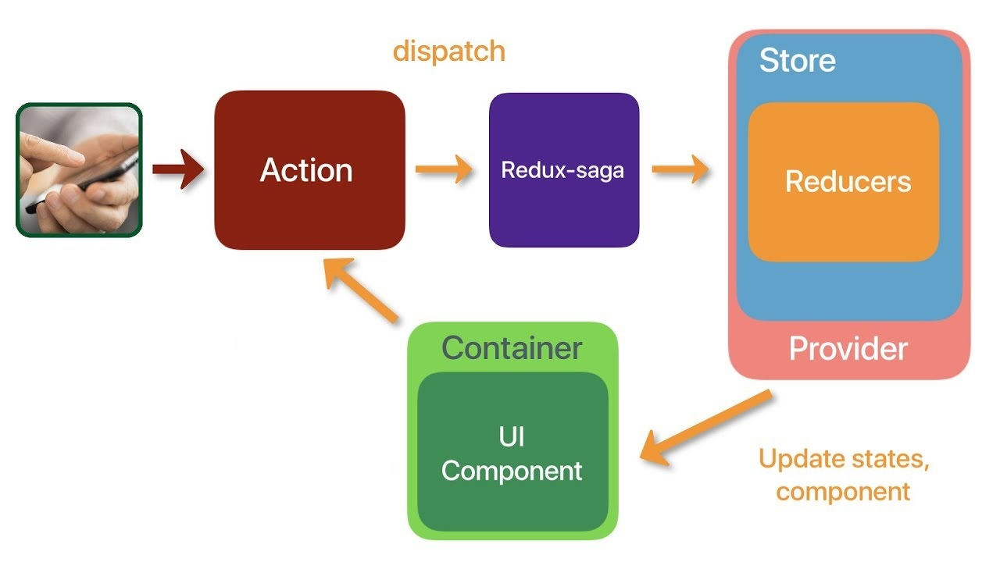

# Getting Started with Redux Saga



## What is a Saga
* A long-running background process
* Responsible for application side effects
* Used with ES6 yield generator functions
* Controlled by the Redux Saga process manager
* List for actions, dispatch other actions using effects

## Promise key points
* a promise is similar to a task in .NET

## Yield key points
* yield only works in generator functions
* less lines of code and indentation

## Generator functions
* function* functionName(){}
* must call .next() to get result
* each time next() is called it will run up to the next yield line.
* a generator is similar to a .NET IEnumerable yield function
```
function* getValue(a, b)
{
    const value a + b;
    return a + b;
}
let gen = getValue(1,2);
let data = gen.next().value;
```

## Redux Saga Generator key points
* Without redux need wrapper code to capture response from API
```
function* getData()
{
    let data = yeild api.call('/cart');
    return data + 5;
}

let gen = getData();
let promise = gen.next();
promise.then(data => {
    let value = gen.next(data);
})
```
* Sagas are automatically wrapped by redux-saga
* They behave very similar to async/await tasks in .NET
```
function* mySaga()
{
    yield delay(500);
    yield delay(700);
    console.log("Saga complete");
}
```
## Redux Saga Effects
* Thread Management Effects = call, fork, spawn, apply
* Action creation = put
* Data seeding = select
* Flow control = take, takeEvery, takeLatest

### Take
* Pauses execution of code and waits for an action to be dispatched
```
yield take("ACTION_NAME");
```

### Put
* Dispatches an action
* Same as calling dispatch in redux-thunk
* Useful for passing data to another saga in combination with Take
```
yield put("ACTION_NAME", value: 42);
```
### Call
* Just like calling a method directly
* Used for testing
* Use instead of actually calling api
```
let fn = () => {console.log("Called")}
yield call(fn);
```

### Fork
* Like call but caller continues without pausing execution
```
let fn = () => {console.log("Called")}
yield fork(fn);
```

### Spawn
* Like fork but is not a child process of the caller
* If caller errors or itself is called the spawned process is not affected.
```
let fn = () => {console.log("Called")}
yield spawn(fn);
```

### TakeEvery
* Combination on Take and Fork
* Each time action is dispatched it forks
```
yield takeEvery("ACTION_NAME");
```

### Cancel
* Stops a forked process at most recent yield
* Invokes finally on forked process
```
function* saga(){
    let forked = yield effects.fork(process);
    yield delay(5000);
    yield cancel(forked)l
    console.info("DONE!");
}
```

### Cancelled
* return true if callee process has been cancelled by caller
* Used in finally block to determine if cancellation is cause of termination
```
function* process(){
    try{
        while(true)
        {
            console.log("Looped");
            yield delay(500);
        }
    } finally{
        const canncelled = yield cancelled();
        console.info("Cancelled?", cancelled);
    }
}
```
### TakeLatest
* Combination of Fork, TakeEvery and Cancel
* Forks child process each time action is dispatched, while keeping exactly one instance of the child process running.
```
yield takeLatest("EVENT_NAME", process);
```

### Select
* Returns a copy of the applications state

### All
* Combines a number of take actions
* Will only resume when all the actions have been dispatched.
* Order does not matter

## Channels
* Action Channel = Buffers actions to be processed one at a time
* Event Channel = Connects app to outside event sources. e.g web sockets
* Channel = Communicate between two sagas. This can be done with regular actions but that means that all sagas see the information.

### Action Channel (Queue)
* Records all events of a specified type
* Calling take accesses and removes the oldest record
* Used to handle actions that would otherwise be lost 
```
const chan = yield actionChannel("EVENT_NAME");
yield take(chan);
```

### Generic Channel
* Special communication between two sagas
* Action types not required. Implied they will be of a particular type.
```
let chan = yield channel();

function* handleRequest(chan){
    while(true)
    {
        let payload = yield effects.take(chan);
        console.info("Got payload", payload);
        yield delay(1000);
    }
}

//Workers
yield fork(handleRequest, chan);
yield fork(handleRequest, chan);

yield put(chan, {payload:42});
```

### Event Channels
* Wraps outside source of events. e.g websockets
* Takes outside events and map to redux-saga events


## Redux Thunk vs Saga
| Thunk        | Saga                                                   |           
| ------------- |:-------------:                                        |
| Redux Middleware      | Redux Middleware                              |
| Created by Redux creator      | Created by third party developer      |
| Any JavaScript |     Only ES6 environments that support Yield         |
| No built-in async |     yield and generator simplify async            |
| No way to orchestrate side-effects between thunks |    Uses effects and plain actions to coordinate sagas |

## Redux Saga
* Dispatch functions using this.props.dispatch(function(dispatch){})
* If export default connect(mapStateToProps,{speakersFetchData})(SpeakersRedux) the following syntax can be used, this.props.speakersFetchData()
* [redux-actions](https://redux-actions.js.org/) can be used to easily create and handle actions
1. Install redux saga
```
npm install lodash keymirror
npm install redux react-redux redux-logger react-router-redux redux-saga redux-logger redux-devtools-extension --save
npm install redux-immutable-state-invariant --save-dev
npm install redux-actions
npm install reselect
npm install prop-types
```
2. Create the following directories
```
\store
\store\reducers
\store\actions
\store\sagas
```
3. Create a store\configureStore.js file and put in the following contents.
```
import {createStore, applyMiddleware, compose} from 'redux';
import { createLogger } from 'redux-logger';

import createSagaMiddleware from 'redux-saga';
import {initSagas} from './sagas/initSagas';

import rootReducer from './combineReducers';

const sagaMiddleware = createSagaMiddleware();
const middleware = [
    sagaMiddleware
];

const enhancers = [];

if (process.env.NODE_ENV === 'development') {
    console.log('Running in Development Mode');
    
    const immutableState = require('redux-immutable-state-invariant').default();
    middleware.push(immutableState);

    //logger must be last
    const logger = createLogger({collapsed: true});
    middleware.push(logger);

    //redux dev tools
    if (typeof window !== 'undefined' && window.__REDUX_DEVTOOLS_EXTENSION__) {
        const devToolsExtension = window.__REDUX_DEVTOOLS_EXTENSION__();
        enhancers.push(devToolsExtension);
    }
}

export default function configureStore(initialState = {}) {
    const store = createStore(
        rootReducer,
        initialState,
        compose(applyMiddleware(...middleware), ...enhancers)
    );

      //HMR
      if (module.hot && process.env.NODE_ENV !== 'production') {
          console.log('HMR enabled for reducers');
          module.hot.accept('./combineReducers', () => {
              console.log('HMR Reducers');
              store.replaceReducer(rootReducer);
          });
      }

    initSagas(sagaMiddleware);
    return store;
}
```
4. Create a store\sagas\initSagas.js and put in the following contents.
```
import * as sagas from './sagas';

export const initSagas = (sagaMiddleware) => {
    Object.values(sagas).forEach(sagaMiddleware.run.bind(sagaMiddleware));
}
```
5. Example store\sagas\createUserSaga.js
```
import {delay} from 'redux-saga';

export function* currentUserSaga(){
    while(true)
    {
        yield delay(1000);
        console.info('User saga loop');
    }
}
```
6. Create a store\sagas\index.js file and put in the following contents.
```
export{ currentUserSaga } from './createUserSaga'
```
7. Example store\actions\speakers.js.
* The event payloads are stored in a seperate file.
* An alternative to creating the payloads is using [redux-actions](https://github.com/redux-utilities/redux-actions)
```
import * as actionTypes from './actionTypes'

export function speakersFetchData() {
    return {
        type: SPEAKER_LOAD,
        payload: {
            request:{
                url:'/data/speakers.json'
            } 
        }
    }
}
```
8. It is often a good idea to extract the action constants into another file named actionTypes.js
```
import keyMirror from 'keymirror';

export var ActionTypes = keyMirror({
    CHANGE_ORIGIN_AMOUNT: null
})
```
They can then be imported and used in the reducer, actions and saga files using the following:
```
import actionTypes from './actionTypes';
actionTypes.CHANGE_ORIGIN_AMOUNT
```
9. Create a \store\actions.js
```
export {
    speakersFetchData,
    decrement,
    fetchConversionRate
} from './speakers'

export {
    action1,
    action2
} from './sessions'
```
10. Example reducers\speakers.js
```
import actionTypes from '../actionTypes';

var defaultState = {
    data: [],
    isLoading: true,
    hasErrored: false,
    errorMessage: ""
};

export const speakersReducer = (state = defaultState, action) => {
    switch (action.type) {

        case SPEAKER_LOAD: {
            return Object.assign({}, state, {
                isLoading: true,
                hasErrored: false
            });
        }

        case SPEAKER_LOAD_SUCCESS: {
            return Object.assign({}, state, {
                data: action.payload.data,
                isLoading: false,
                hasErrored: false
            });
        }

        case SPEAKER_LOAD_FAIL: {
            return Object.assign({}, state, {
                isLoading: false,
                hasErrored: true,
                errorMessage: action.error.message
            });
        }

        default:
            return state;
    }
}
```
11. Create a reducers\index.js file and put in the following contents. React expects one reducer.
```
import { combineReducers } from 'redux';
import { speakers } from './speakers';

export default combineReducers({
    speakers : speakers
})
```
12. update index.js to include the Provider element
```
import React from 'react';
import ReactDOM from 'react-dom';
import './index.css';
import App from './App';
import * as serviceWorker from './serviceWorker';

import { Provider } from 'react-redux';
import configureStore from "./store/configureStore";
const store = configureStore(window.__STATE__);

const app = (
     <Provider store={store}>
        <BrowserRouter basename="/">
            <App />
        </BrowserRouter>
    </Provider>
);

const render = () => {
    return ReactDOM.render(app,
      document.getElementById('root')
    );
  };

  render();

//HMR
//https://medium.com/@brianhan/hot-reloading-cra-without-eject-b54af352c642
//https://duske.me/setting-up-hot-module-replacement-with-create-react-app-and-redux/
if (module.hot && process.env.NODE_ENV !== 'production') {
    console.log('HMR enabled for components');
    module.hot.accept('./App', () => {
        console.log('HMR App');
        render();
      });
}

// If you want your app to work offline and load faster, you can change
// unregister() to register() below. Note this comes with some pitfalls.
// Learn more about service workers: http://bit.ly/CRA-PWA
serviceWorker.unregister();
```
13. Dispatching action in a component
```
import React, {Component} from 'react';

import SpeakersHeader from './SpeakersHeader';
import SpeakerList from './SpeakerList';

import { connect } from 'react-redux';
import { speakersFetchData } from "../../redux/actions/speakers"

import {totalSelector} from 'path/to/selector'

class SpeakersRedux extends Component {
    state = {
        isLoading: true,
        appData: []
    };

    componentDidMount() {
        this.props.speakersFetchData();
    }

    render() {
        if (this.props.isLoading) {
             return <span><i>Loading...</i></span>
         }
         else if (this.props.hasErrored) {
            return <span><b>Failed to load data:{this.props.errorMessage}</b></span>
        }
         else {
            return (
                <div>
                    <SpeakersHeader/>
                    <SpeakerList speakers={this.props.speakers} />
                     {/*<span>{JSON.stringify(this.state.appData)}</span>*/}
                 </div>
             );
         }
    }
} 

const mapStateToProps = (state, props) => {
    return{
        speakers: state.speakers.data,
        hasErrored: state.speakers.hasErrored,
        isLoading: state.speakers.isLoading,
        errorMessage: state.speakers.errorMessage,
		inventoryValue: totalSelector(state)
    };
};

export default connect(mapStateToProps,{speakersFetchData})(SpeakersRedux)
```
14. Creating Selectors can be useful for mapping state to props
```
import { createSelector } from 'reselect'

const shopItemsSelector = state => state.shop.items
const taxPercentSelector = state => state.shop.taxPercent

const subtotalSelector = createSelector(
  shopItemsSelector,
  items => items.reduce((acc, item) => acc + item.value, 0)
)

const taxSelector = createSelector(
  subtotalSelector,
  taxPercentSelector,
  (subtotal, taxPercent) => subtotal * (taxPercent / 100)
)

export const totalSelector = createSelector(
  subtotalSelector,
  taxSelector,
  (subtotal, tax) => ({ total: subtotal + tax })
)
```
15. Important once user using the combineReducers functionality the reducer must be specified in the mapStateToProps function.
```
export default connect((state, props) => {
    return {
        originAmount: state.amount.originAmount,
        destinationAmount: state.amount.destinationAmount,
        conversionRate: state.amount.conversionRate,
        feeAmount: state.amount.feeAmount,
        totalCost : state.amount.totalCost
    }
})(Conversion);
```
16. Install [Redux Dev Tools](https://chrome.google.com/webstore/detail/redux-devtools/lmhkpmbekcpmknklioeibfkpmmfibljd?hl=en)

## Saga Template
```
import {
	all,
	put,
	call,
	takeLatest,
	select
} from 'redux-saga/effects';

import * as action from './actions';
import * as requestActions from 'store/state/requests/actions';
import api from './api';

export default function* worker1(action) {
    try
    {
        yield put(requestActions.RequestStarted(action.type));
        var payload= {};
        var response = yield call([api,"methodName"], payload);
        yield put(actions.DataReceived(response));
        yield put(requestActions.EndRequest(action.type));
    }
    catch
    {
         yield put(requestActions.EndRequestWithError(action.type));
    }
}


export default function* worker2(action) {
    try
    {
        yield put(requestActions.RequestStarted(action.type));
        var payload= {};
        var response = yield call([api,"methodName"], payload);
        yield put(actions.DataReceived(response));
        yield put(requestActions.EndRequest(action.type));
    }
    catch
    {
         yield put(requestActions.EndRequestWithError(action.type));
    }
}

export default function* foreman() {
	yield all([
		takeLatest(actions.action1, worker1),
        takeLatest(actions.action2, worker2),
	]);
}
```
## Selectors
* [What are selectors?](https://medium.com/@pearlmcphee/selectors-react-redux-reselect-9ab984688dd4)
* Selectors encapsulate knowledge of where data lives and how to derive it, and therefore can help you write more reusable code.


## PluralSight Courses
* [Redux Saga](https://app.pluralsight.com/library/courses/redux-saga/table-of-contents)

## Authors

* **David Ikin**