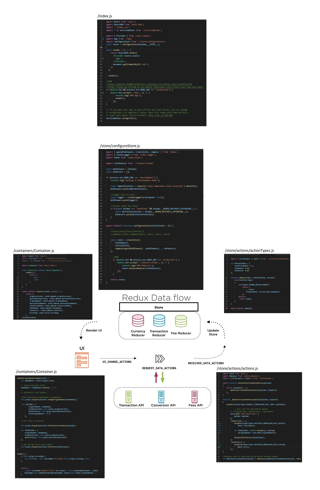
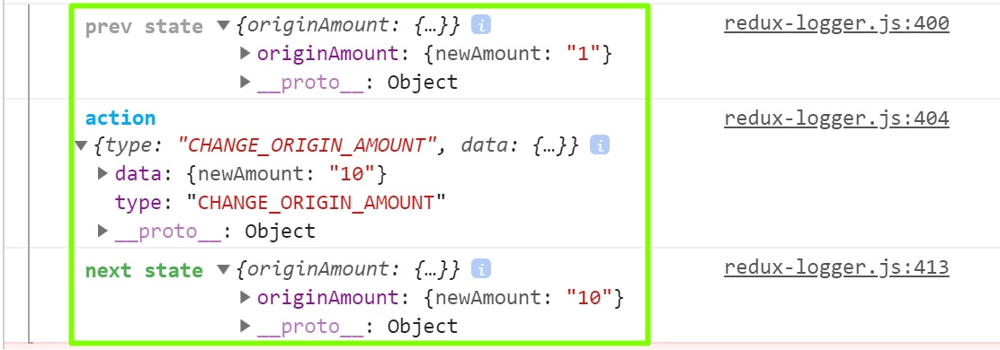

# Getting Started with Redux



## Flux and [Redux](https://redux.js.org)
* Flux is an architectural pattern
* Redux is an implementation of the pattern
* For complex applications
* New concept around state and UI updates
* State stored outside of components
* Action > Dispatcher > Store  > View
* Immutability
* Makes state predictable
* A thunk is a function that wraps an expression to delay it's execution. A delegate in .NET
* [You Might Not Need Redux](https://medium.com/@dan_abramov/you-might-not-need-redux-be46360cf367)
* [react-router & react-router-dom (react-router-redux is depreciated)](https://github.com/ReactTraining/react-router)
* [BrowserRouter](https://reacttraining.com/react-router/web/api/BrowserRouter)

## Immutability (Merge or Copy)
Clone and modify instead of mutating original
```
var history[];
var state = {color: 'red', name:'Adam', point:5}
var state2 = Object.assign({}, state, {point: 50})
history.push(state, state2);
```
```
var history[];
var state = {color: 'red', name:'Adam', point:5};
var state2 = {...state, point: 50};
history.push(state, state2);
```

## Redux Packages
* redux: main library (independent from React)
* react-redux: connects your redux store with ReactComponents (Takes care of subscribing to state changes that re-render component and child components)
* redux-thunk: a redux middleware which helps you with async actions

## Redux Process
1. Dispatch Action
```
this.props.dispatch({type:"CHANGE_ORIGIN_AMOUNT", payload:{}})
```
2. Client and update store state using Reducer
```
var defaultState = {
    originAmount: '0.00'
};

function amountReducer(state = defaultState, action){
    if(action.type === 'CHANGE_ORIGIN_AMOUNT')
    {
        //immutable - new object, copy old state and update
        return {
            ...state,
            originAmount: action.data.newAmount
        };
    } else if(action.type === 'RECEIVED_CONVERSION_RATE')
    {
        //immutable - new object, copy old state and update
        return {
            ...state,
            conversionRate: action.data.xRate,
            destinationAmount: action.data.destAmount
        };
    }
    
    return state;
}
```
3. Update component UI props using connect mapStateToProps
```
export default connect((state, props) => {
    return {
        originAmount: state.originAmount
    }
})(Conversion);
```

## Redux Only Example
1. Create new app and install redux
```
npm create-react-app my-app --use-npm
install redux
```
2. create a store/configureStore.js file and import from index.js
```
import { createStore } from 'redux'; 

var defaultState = {
    originAmount: '0.00'
};

function amount(state = defaultState, action){
    if(action.type === 'CHANGE_ORIGIN_AMOUNT')
    {
        //immutable - new object, copy old state and update
        //=== to see if you are referring to the same object
     
        var newState = Object.assign({}, state, {originAmount: action.data});
        console.log('same?', state === newState);
        return newState;
    }

    if(action.type === 'CHANGE_ORIGIN_AMOUNT2')
    {
        //immutable - new object, copy old state and update
        //=== to see if you are referring to the same object
     
        //object spread
        return {
            ...state,
            originAmount: action.data
        };
    }
    
    return state;
}

var store = createStore(amount);

store.subscribe(function(){
    console.log('state', store.getState());
})

store.dispatch({type:'CHANGE_ORIGIN_AMOUNT', payload: '300.65' });
store.dispatch({type:''});
store.dispatch({type:''});

export default store;
```

## React-Redux Example
* Dispatch actions using this.props.dispatch({type:"CHANGE_ORIGIN_AMOUNT", payload:{}})
1. Create new app and install redux
```
npm create-react-app my-app --use-npm
npm install redux
npm install react-redux
npm install redux-logger
npm install redux-immutable-state-invariant
```
2. create a store/configureStore.js file and import from index.js
```
import { applyMiddleware, createStore, compose  } from 'redux';
import { createLogger } from 'redux-logger';

var defaultState = {
    originAmount: '0.00'
};

function amountReducer(state = defaultState, action){
    if(action.type === 'CHANGE_ORIGIN_AMOUNT')
    {
        //immutable - new object, copy old state and update
        //=== to see if you are referring to the same object
     
        var newState = Object.assign({}, state, {originAmount: action.data});
        console.log('same?', state === newState);
        return newState;
    }

    if(action.type === 'CHANGE_ORIGIN_AMOUNT2')
    {
        //immutable - new object, copy old state and update
        //=== to see if you are referring to the same object
     
        //object spread
        return {
            ...state,
            originAmount: action.data
        };
    }
    
    return state;
}

const middleware = [];
const enhancers = [];

if (process.env.NODE_ENV === 'development') {
    console.log('Running in Development Mode');
    
    const immutableState = require('redux-immutable-state-invariant').default();
    middleware.push(immutableState);

    const logger = createLogger({collapsed: true});
    middleware.push(logger);

    if (typeof window !== 'undefined' && window.__REDUX_DEVTOOLS_EXTENSION__) {
        const devToolsExtension = window.__REDUX_DEVTOOLS_EXTENSION__();
        enhancers.push(devToolsExtension);
    }
}

export default function configureStore(initialState = {}) {

    //func1(func2(func3(func4))))
    //compose allows compose(func1, func2, func3, func4)

    return createStore(
        amountReducer,
        compose(applyMiddleware(...middleware), ...enhancers)
    );
}
```
3. Within index.js wrap the App tag with a Provider and pass in the store.
```
import React from 'react';
import ReactDOM from 'react-dom';
import './index.css';
import * as serviceWorker from './serviceWorker';

import { Provider } from 'react-redux';
import App from './App'
import configureStore from "./store/configureStore";
const store = configureStore(window.__STATE__);

const render = () => {
    return ReactDOM.render(
      <Provider store={store}>
        <App />
      </Provider>,
      document.getElementById('root')
    );
  };

  render();

//HMR
//https://medium.com/@brianhan/hot-reloading-cra-without-eject-b54af352c642
//https://duske.me/setting-up-hot-module-replacement-with-create-react-app-and-redux/
if (module.hot && process.env.NODE_ENV !== 'production') {
    console.log('HMR Enabled for Components');
    module.hot.accept('./App', () => {
        console.log('HMR App');
        render();
      });
}

// If you want your app to work offline and load faster, you can change
// unregister() to register() below. Note this comes with some pitfalls.
// Learn more about service workers: http://bit.ly/CRA-PWA
serviceWorker.unregister();
```
4. Connect the container component to redux by using the connect import
```
import React, { Component } from 'react';
import { connect } from 'react-redux';
 
class UpdateScore extends Component {
    state = {  }
    render() { 
        return (<div></div>);
    }
}
 
export default connect((state, props) =>{
    console.log('connect state', state);
    console.log('connect props', props);

    //return new props
    return {
        originAmount: state.originAmount
    }
})(UpdateScore);
```
5. It is convention to put connected componentents in a containers folder and non connected components in the components folder
6. The react-redux logger gives extremely useful information in regards to what is happening under the hood in regards to state.



## Redux Thunk (Allows dispatching functions rather than events)
* Dispatch functions using this.props.dispatch(function(dispatch){})
1. Install axios and redux thunk
```
npm install axios lodash keymirror
npm install redux react-redux redux-logger redux-axios-middleware react-router-redux redux-thunk redux-logger --save
npm install redux-immutable-state-invariant --save-dev
```
2. Create the following directories
```
\store
\store\reducers
\store\actions
```
3. Create a store\configureStore.js file and put in the following contents.
```
import {createStore, applyMiddleware} from 'redux';
import axios from 'axios';
import axiosMiddleware from 'redux-axios-middleware';
import { createLogger } from 'redux-logger';
import thunk from 'redux-thunk';

import rootReducer from './reducers/index';

const apiUrl = 'http://localhost:4000/api';

const middleware = [
    thunk,
    axiosMiddleware(axios.create({baseURL:apiUrl}))
];

const enhancers = [];

if (process.env.NODE_ENV === 'development') {
    console.log('Running in Development Mode');
    
    const immutableState = require('redux-immutable-state-invariant').default();
    middleware.push(immutableState);

    //logger must be last
    const logger = createLogger({collapsed: true});
    middleware.push(logger);

    //chrome redux dev tools
    if (typeof window !== 'undefined' && window.__REDUX_DEVTOOLS_EXTENSION__) {
        const devToolsExtension = window.__REDUX_DEVTOOLS_EXTENSION__();
        enhancers.push(devToolsExtension);
    }
}

export default function configureStore(initialState = {}) {
    const store = createStore(
        rootReducer,
        initialState,
        compose(applyMiddleware(...middleware), ...enhancers)
    );

     //HMR
      if (module.hot && process.env.NODE_ENV !== 'production') {
          console.log('HMR Enabled for Reducers');
          module.hot.accept('./reducers/index', () => {
              console.log('HMR Reducers');
              store.replaceReducer(rootReducer);
          });
      }       

      return store;
}
```
4. Example \store\actions\speakers.js.
The event payloads are stored in a seperate file.
```
import axios from 'axios';
import debounce from 'lodash.debounce';
import * as actionTypes from './actionTypes';

export function speakersFetchData() {
    return {
        type: actionTypes.SPEAKER_LOAD,
        payload: {
            request:{
                url:'/data/speakers.json'
            } 
        }
    }
}

export const decrement = () =>{
    return {
        type: actionTypes.DECREMENT
    }
}

export function fetchConversionRate(payload)
{
    return (dispatch) => {
        makeConversionAjaxCall(payload, dispatch);
    };
}

function _makeConversionAjaxCall(payload, dispatch)
{
    dispatch({type:actionTypes.REQUEST_CONVERSION_RATE, payload: payload});

            // ajax call for destination amount
        // originCurrency, destCurrency, originAmount
        axios.get('/api/conversion', {
            params: payload
        })
        .then((resp) => {
            dispatch({type:actionTypes.RECEIVED_CONVERSION_RATE_SUCCESS, payload: resp.data});
        })
        .catch((err)=>{
            dispatch({type:actionTypes.RECEIVED_CONVERSION_RATE_FAILURE, payload: err});
        });
}

//debounce waits a specified period before sending request
var makeConversionAjaxCall = debounce(_makeConversionAjaxCall, 300);
```
5. Create a \store\actions\index.js
```
export {
    speakersFetchData,
    decrement,
    fetchConversionRate
} from './speakers'

export {
    action1,
    action2
} from './sessions'
```
6. It is often a good idea to extract the action constants into another file named actionTypes.js
```
import keyMirror from 'keymirror';

export var ActionTypes = keyMirror({
    CHANGE_ORIGIN_AMOUNT: null,
    SPEAKER_LOAD: null,
    REQUEST_CONVERSION_RATE: null,
    RECEIVED_CONVERSION_RATE_SUCCESS: null,
    RECEIVED_CONVERSION_RATE_FAILURE: null
})
```
They can then be imported and used in the reducer and actions file using the following:
```
import * as actionTypes from './actionTypes';
actionTypes.CHANGE_ORIGIN_AMOUNT
```
7. Example reducers\speakers.js
```
import {SPEAKER_LOAD, SPEAKER_LOAD_FAIL, SPEAKER_LOAD_SUCCESS} from "../actions/speakers";

var defaultState = {
    data: [],
    isLoading: true,
    hasErrored: false,
    errorMessage: ""
};

export function speakers(state = defaultState, action) {
    switch (action.type) {

        case SPEAKER_LOAD: {
            return Object.assign({}, state, {
                isLoading: true,
                hasErrored: false
            });
        }

        case SPEAKER_LOAD_SUCCESS: {
            return Object.assign({}, state, {
                data: action.payload.data,
                isLoading: false,
                hasErrored: false
            });
        }

        case SPEAKER_LOAD_FAIL: {
            return Object.assign({}, state, {
                isLoading: false,
                hasErrored: true,
                errorMessage: action.error.message
            });
        }

        default:
            return state;
    }
}
```
8. Create a reducers\index.js file and put in the following contents. React expects one reducer.
```
import { combineReducers } from 'redux';
import { speakers } from './speakers';

export default combineReducers({
    speakers : speakers
})
```
9. update index.js to include the Provider element
```
import React from 'react';
import ReactDOM from 'react-dom';
import './index.css';
import App from './App';
import * as serviceWorker from './serviceWorker';

import { Provider } from 'react-redux';
import configureStore from "./redux/configureStore";
const store = configureStore(window.__STATE__);

const render = () => {
    return ReactDOM.render(
      <Provider store={store}>
        <App />
      </Provider>,
      document.getElementById('root')
    );
  };

  render();

//HMR
//https://medium.com/@brianhan/hot-reloading-cra-without-eject-b54af352c642
//https://duske.me/setting-up-hot-module-replacement-with-create-react-app-and-redux/
if (module.hot && process.env.NODE_ENV !== 'production') {
    console.log('HMR Enabled for Components');
    module.hot.accept('./App', () => {
        console.log('HMR App');
        render();
      });
}

// If you want your app to work offline and load faster, you can change
// unregister() to register() below. Note this comes with some pitfalls.
// Learn more about service workers: http://bit.ly/CRA-PWA
serviceWorker.unregister();
```
10. Dispatching action in a component
```
import React, {Component} from 'react';

import SpeakersHeader from './SpeakersHeader';
import SpeakerList from './SpeakerList';

import { connect } from 'react-redux';
import { speakersFetchData } from "../../redux/actions/speakers"

class SpeakersRedux extends Component {
    state = {
        isLoading: true,
        appData: []
    };

    componentDidMount() {
        this.props.speakersFetchData();
    }

    render() {
        if (this.props.isLoading) {
             return <span><i>Loading...</i></span>
         }
         else if (this.props.hasErrored) {
            return <span><b>Failed to load data:{this.props.errorMessage}</b></span>
        }
         else {
            return (
                <div>
                    <SpeakersHeader/>
                    <SpeakerList speakers={this.props.speakers} />
                     {/*<span>{JSON.stringify(this.state.appData)}</span>*/}
                 </div>
             );
         }
    }
} 

const mapStateToProps = (state) => {
    return{
        speakers: state.speakers.data,
        hasErrored: state.speakers.hasErrored,
        isLoading: state.speakers.isLoading,
        errorMessage: state.speakers.errorMessage
    };
};

export default connect(mapStateToProps,{speakersFetchData})(SpeakersRedux)
```
11. Important once user using the combineReducers functionality the reducer must be specified in the mapStateToProps function.
```
export default connect((state, props) => {
    return {
        originAmount: state.amount.originAmount,
        destinationAmount: state.amount.destinationAmount,
        conversionRate: state.amount.conversionRate,
        feeAmount: state.amount.feeAmount,
        totalCost : state.amount.totalCost
    }
})(Conversion);
```
12. Install [Redux Dev Tools](https://chrome.google.com/webstore/detail/redux-devtools/lmhkpmbekcpmknklioeibfkpmmfibljd?hl=en) 

## Reducer Template
* [Immutable Update Patterns](https://redux.js.org/recipes/structuringreducers/immutableupdatepatterns)
* Try and keep reducer state flat and one level
```
var defaultState ={

}

function error(state = defaultState, action){
    switch(action.type)
    {
        case(''):
            return {
                ...state
            }
        default:
            return state;
    }
}

export default error;
```

## PluralSight Courses
* [Redux Fundamentals](https://app.pluralsight.com/library/courses/redux-fundamentals/table-of-contents)
* [Building a Website with React and ASP.NET Core](https://www.pluralsight.com/courses/aspdotnet-core-react-building-website)

## Authors

* **David Ikin**